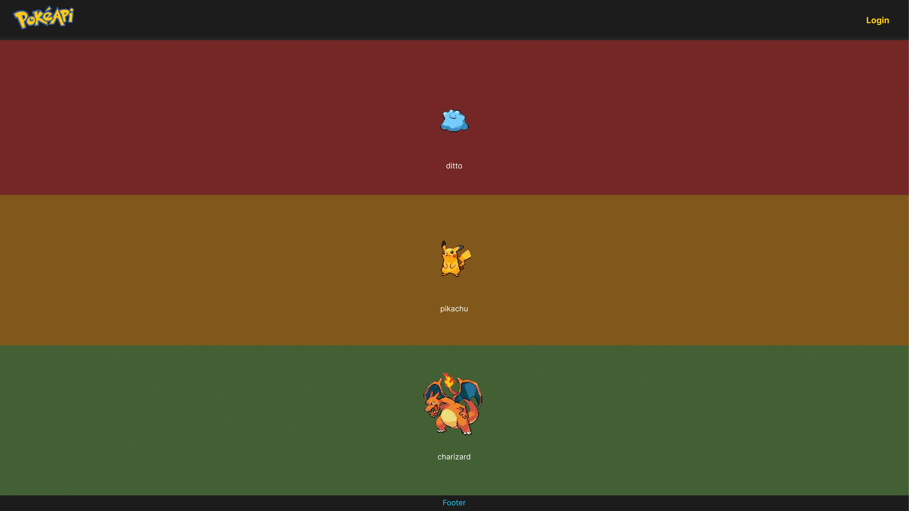

# PokemonAPI test assignment
This project contains an test assignment for a Pokemon frontend application.
The objective of this assignment is to implement this ui from this figma design.

**Make sure the items of the pokemon list are filling the screen.**

## Logic
The app should implement the following capabilities:
1. Fetch pokemons list from [this url](https://pokeapi.co/api/v2/pokemon?limit=50&offset=0)
2. Pick random pokemons to show
3. Display the name and the image of each picked pokemon

## How to run
Install all package requirements.  
You can use either package manager that suits you.
Just run the `start` command in the `package.json` file.

> Yarn example:
`yarn start`